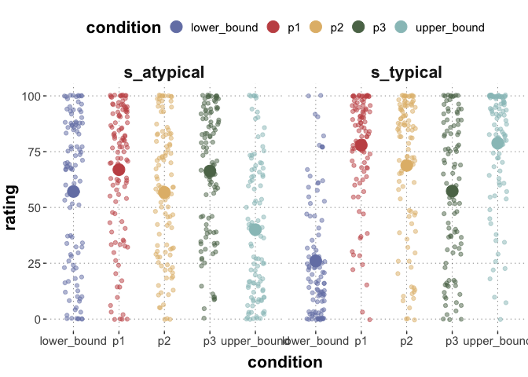

CS2: utterance proposer evals
================

``` r
library(tidyverse)
library(brms)
library(tidyboot)
library(cspplot)
```

Read data:

``` r
path = "../data/cs2-utterance-proposer/results_20_SAGE_cs2-utterance-proposer-evals_full.csv"
d <- read_csv(path)
```

    ## Rows: 306 Columns: 22
    ## ── Column specification ────────────────────────────────────────────────────────
    ## Delimiter: ","
    ## chr  (9): comments, correct_answer, education, gender, itemOrder, languages,...
    ## dbl (13): submission_id, age, experiment_duration, experiment_end_time, expe...
    ## 
    ## ℹ Use `spec()` to retrieve the full column specification for this data.
    ## ℹ Specify the column types or set `show_col_types = FALSE` to quiet this message.

``` r
# exclude prolific info
#d %>% select(-prolific_pid, -prolific_study_id, -prolific_session_id) %>% write_csv(path)
```

Check attention check performance:

``` r
d_preprocessed <- d %>%
  mutate(
    correct_answer = as.numeric(correct_answer),
    lower_bound = as.numeric(lower_bound),
    upper_bound = as.numeric(upper_bound),
    p1 = as.numeric(p1),
    p2 = as.numeric(p2),
    p3 = as.numeric(p3)
  )
```

    ## Warning: There was 1 warning in `mutate()`.
    ## ℹ In argument: `correct_answer = as.numeric(correct_answer)`.
    ## Caused by warning:
    ## ! NAs introduced by coercion

``` r
fillers <- d_preprocessed %>% filter(trial_type == "filler") %>%
  rowwise() %>%
  mutate(
    is_correct = as.numeric(abs(correct_answer - lower_bound) < 6 &
                          abs(correct_answer - upper_bound) < 6 &
                          abs(correct_answer - p1) < 6 &
                          abs(correct_answer - p2) < 6 &
                          abs(correct_answer - p3) < 6
                          )
         )
# attention check passing rate
sum(fillers$is_correct) / nrow(fillers)
```

    ## [1] 0.7058824

Analyse main trials:

``` r
main_trials <- d_preprocessed %>%
  filter(trial_type == "main")

main_trials_summary <- main_trials %>%
  summarize(
    lower_bound = mean(lower_bound),
    upper_bound = mean(upper_bound),
    p1 = mean(p1),
    p2 = mean(p2),
    p3 = mean(p3)
  ) %>%
  pivot_longer(cols = c(lower_bound, upper_bound, p1, p2, p3), names_to = "condition", values_to = "rating")

main_trials_long <- main_trials %>%
  pivot_longer(cols = c(upper_bound, lower_bound, p1, p2, p3), names_to = "condition", values_to = "rating")

main_trials_long %>%
  ggplot(., aes(x = condition, y = rating, color = condition)) +
  geom_point(alpha=0.5, position=position_jitter(0.2)) +
  geom_point(data = main_trials_summary, aes(x = condition, y = rating, color = condition), size=5) +
  theme_csp()
```

    ## Warning: The `scale_name` argument of `discrete_scale()` is deprecated as of ggplot2
    ## 3.5.0.
    ## This warning is displayed once every 8 hours.
    ## Call `lifecycle::last_lifecycle_warnings()` to see where this warning was
    ## generated.

<!-- -->

Now group these by state type (typical vs atypical):

``` r
main_trials <- d_preprocessed %>%
  filter(trial_type == "main")

main_trials_summary_byState <- main_trials %>%
  group_by(state_type) %>%
  summarize(
    lower_bound = mean(lower_bound),
    upper_bound = mean(upper_bound),
    p1 = mean(p1),
    p2 = mean(p2),
    p3 = mean(p3)
  ) %>%
  pivot_longer(cols = c(lower_bound, upper_bound, p1, p2, p3), names_to = "condition", values_to = "rating")

main_trials_long %>%
  ggplot(., aes(x = condition, y = rating, color = condition)) +
  geom_point(alpha=0.5, position=position_jitter(0.2)) +
  geom_point(data = main_trials_summary_byState, aes(x = condition, y = rating, color = condition), size=5) +
  facet_grid(.~state_type) +
  theme_csp()
```

<!-- -->

``` r
main_trials_long_rm <- main_trials_long %>%
  mutate(condition = factor(condition))
contrasts(main_trials_long_rm$condition)
```

    ##             p1 p2 p3 upper_bound
    ## lower_bound  0  0  0           0
    ## p1           1  0  0           0
    ## p2           0  1  0           0
    ## p3           0  0  1           0
    ## upper_bound  0  0  0           1

``` r
rm_cs2_utt <- brm(
  rating ~ condition + (1 + condition | vignette) + (1 + condition | submission_id),
  data = main_trials_long_rm,
  iter = 4000
)
```

    ## Compiling Stan program...

    ## Trying to compile a simple C file

    ## Running /Library/Frameworks/R.framework/Resources/bin/R CMD SHLIB foo.c
    ## clang -arch arm64 -I"/Library/Frameworks/R.framework/Resources/include" -DNDEBUG   -I"/Library/Frameworks/R.framework/Versions/4.2-arm64/Resources/library/Rcpp/include/"  -I"/Library/Frameworks/R.framework/Versions/4.2-arm64/Resources/library/RcppEigen/include/"  -I"/Library/Frameworks/R.framework/Versions/4.2-arm64/Resources/library/RcppEigen/include/unsupported"  -I"/Library/Frameworks/R.framework/Versions/4.2-arm64/Resources/library/BH/include" -I"/Library/Frameworks/R.framework/Versions/4.2-arm64/Resources/library/StanHeaders/include/src/"  -I"/Library/Frameworks/R.framework/Versions/4.2-arm64/Resources/library/StanHeaders/include/"  -I"/Library/Frameworks/R.framework/Versions/4.2-arm64/Resources/library/RcppParallel/include/"  -I"/Library/Frameworks/R.framework/Versions/4.2-arm64/Resources/library/rstan/include" -DEIGEN_NO_DEBUG  -DBOOST_DISABLE_ASSERTS  -DBOOST_PENDING_INTEGER_LOG2_HPP  -DSTAN_THREADS  -DBOOST_NO_AUTO_PTR  -include '/Library/Frameworks/R.framework/Versions/4.2-arm64/Resources/library/StanHeaders/include/stan/math/prim/mat/fun/Eigen.hpp'  -D_REENTRANT -DRCPP_PARALLEL_USE_TBB=1   -I/opt/R/arm64/include   -fPIC  -falign-functions=64 -Wall -g -O2  -c foo.c -o foo.o
    ## In file included from <built-in>:1:
    ## In file included from /Library/Frameworks/R.framework/Versions/4.2-arm64/Resources/library/StanHeaders/include/stan/math/prim/mat/fun/Eigen.hpp:13:
    ## In file included from /Library/Frameworks/R.framework/Versions/4.2-arm64/Resources/library/RcppEigen/include/Eigen/Dense:1:
    ## In file included from /Library/Frameworks/R.framework/Versions/4.2-arm64/Resources/library/RcppEigen/include/Eigen/Core:88:
    ## /Library/Frameworks/R.framework/Versions/4.2-arm64/Resources/library/RcppEigen/include/Eigen/src/Core/util/Macros.h:628:1: error: unknown type name 'namespace'
    ## namespace Eigen {
    ## ^
    ## /Library/Frameworks/R.framework/Versions/4.2-arm64/Resources/library/RcppEigen/include/Eigen/src/Core/util/Macros.h:628:16: error: expected ';' after top level declarator
    ## namespace Eigen {
    ##                ^
    ##                ;
    ## In file included from <built-in>:1:
    ## In file included from /Library/Frameworks/R.framework/Versions/4.2-arm64/Resources/library/StanHeaders/include/stan/math/prim/mat/fun/Eigen.hpp:13:
    ## In file included from /Library/Frameworks/R.framework/Versions/4.2-arm64/Resources/library/RcppEigen/include/Eigen/Dense:1:
    ## /Library/Frameworks/R.framework/Versions/4.2-arm64/Resources/library/RcppEigen/include/Eigen/Core:96:10: fatal error: 'complex' file not found
    ## #include <complex>
    ##          ^~~~~~~~~
    ## 3 errors generated.
    ## make: *** [foo.o] Error 1

    ## Start sampling

    ## 
    ## SAMPLING FOR MODEL '1c37bfe0e6cacd1587b4ef552f0fbffd' NOW (CHAIN 1).
    ## Chain 1: 
    ## Chain 1: Gradient evaluation took 0.000365 seconds
    ## Chain 1: 1000 transitions using 10 leapfrog steps per transition would take 3.65 seconds.
    ## Chain 1: Adjust your expectations accordingly!
    ## Chain 1: 
    ## Chain 1: 
    ## Chain 1: Iteration:    1 / 4000 [  0%]  (Warmup)
    ## Chain 1: Iteration:  400 / 4000 [ 10%]  (Warmup)
    ## Chain 1: Iteration:  800 / 4000 [ 20%]  (Warmup)
    ## Chain 1: Iteration: 1200 / 4000 [ 30%]  (Warmup)
    ## Chain 1: Iteration: 1600 / 4000 [ 40%]  (Warmup)
    ## Chain 1: Iteration: 2000 / 4000 [ 50%]  (Warmup)
    ## Chain 1: Iteration: 2001 / 4000 [ 50%]  (Sampling)
    ## Chain 1: Iteration: 2400 / 4000 [ 60%]  (Sampling)
    ## Chain 1: Iteration: 2800 / 4000 [ 70%]  (Sampling)
    ## Chain 1: Iteration: 3200 / 4000 [ 80%]  (Sampling)
    ## Chain 1: Iteration: 3600 / 4000 [ 90%]  (Sampling)
    ## Chain 1: Iteration: 4000 / 4000 [100%]  (Sampling)
    ## Chain 1: 
    ## Chain 1:  Elapsed Time: 18.4184 seconds (Warm-up)
    ## Chain 1:                12.7981 seconds (Sampling)
    ## Chain 1:                31.2165 seconds (Total)
    ## Chain 1: 
    ## 
    ## SAMPLING FOR MODEL '1c37bfe0e6cacd1587b4ef552f0fbffd' NOW (CHAIN 2).
    ## Chain 2: 
    ## Chain 2: Gradient evaluation took 0.000222 seconds
    ## Chain 2: 1000 transitions using 10 leapfrog steps per transition would take 2.22 seconds.
    ## Chain 2: Adjust your expectations accordingly!
    ## Chain 2: 
    ## Chain 2: 
    ## Chain 2: Iteration:    1 / 4000 [  0%]  (Warmup)
    ## Chain 2: Iteration:  400 / 4000 [ 10%]  (Warmup)
    ## Chain 2: Iteration:  800 / 4000 [ 20%]  (Warmup)
    ## Chain 2: Iteration: 1200 / 4000 [ 30%]  (Warmup)
    ## Chain 2: Iteration: 1600 / 4000 [ 40%]  (Warmup)
    ## Chain 2: Iteration: 2000 / 4000 [ 50%]  (Warmup)
    ## Chain 2: Iteration: 2001 / 4000 [ 50%]  (Sampling)
    ## Chain 2: Iteration: 2400 / 4000 [ 60%]  (Sampling)
    ## Chain 2: Iteration: 2800 / 4000 [ 70%]  (Sampling)
    ## Chain 2: Iteration: 3200 / 4000 [ 80%]  (Sampling)
    ## Chain 2: Iteration: 3600 / 4000 [ 90%]  (Sampling)
    ## Chain 2: Iteration: 4000 / 4000 [100%]  (Sampling)
    ## Chain 2: 
    ## Chain 2:  Elapsed Time: 17.5754 seconds (Warm-up)
    ## Chain 2:                12.7322 seconds (Sampling)
    ## Chain 2:                30.3076 seconds (Total)
    ## Chain 2: 
    ## 
    ## SAMPLING FOR MODEL '1c37bfe0e6cacd1587b4ef552f0fbffd' NOW (CHAIN 3).
    ## Chain 3: 
    ## Chain 3: Gradient evaluation took 0.000213 seconds
    ## Chain 3: 1000 transitions using 10 leapfrog steps per transition would take 2.13 seconds.
    ## Chain 3: Adjust your expectations accordingly!
    ## Chain 3: 
    ## Chain 3: 
    ## Chain 3: Iteration:    1 / 4000 [  0%]  (Warmup)
    ## Chain 3: Iteration:  400 / 4000 [ 10%]  (Warmup)
    ## Chain 3: Iteration:  800 / 4000 [ 20%]  (Warmup)
    ## Chain 3: Iteration: 1200 / 4000 [ 30%]  (Warmup)
    ## Chain 3: Iteration: 1600 / 4000 [ 40%]  (Warmup)
    ## Chain 3: Iteration: 2000 / 4000 [ 50%]  (Warmup)
    ## Chain 3: Iteration: 2001 / 4000 [ 50%]  (Sampling)
    ## Chain 3: Iteration: 2400 / 4000 [ 60%]  (Sampling)
    ## Chain 3: Iteration: 2800 / 4000 [ 70%]  (Sampling)
    ## Chain 3: Iteration: 3200 / 4000 [ 80%]  (Sampling)
    ## Chain 3: Iteration: 3600 / 4000 [ 90%]  (Sampling)
    ## Chain 3: Iteration: 4000 / 4000 [100%]  (Sampling)
    ## Chain 3: 
    ## Chain 3:  Elapsed Time: 17.9088 seconds (Warm-up)
    ## Chain 3:                13.1041 seconds (Sampling)
    ## Chain 3:                31.0129 seconds (Total)
    ## Chain 3: 
    ## 
    ## SAMPLING FOR MODEL '1c37bfe0e6cacd1587b4ef552f0fbffd' NOW (CHAIN 4).
    ## Chain 4: 
    ## Chain 4: Gradient evaluation took 0.000205 seconds
    ## Chain 4: 1000 transitions using 10 leapfrog steps per transition would take 2.05 seconds.
    ## Chain 4: Adjust your expectations accordingly!
    ## Chain 4: 
    ## Chain 4: 
    ## Chain 4: Iteration:    1 / 4000 [  0%]  (Warmup)
    ## Chain 4: Iteration:  400 / 4000 [ 10%]  (Warmup)
    ## Chain 4: Iteration:  800 / 4000 [ 20%]  (Warmup)
    ## Chain 4: Iteration: 1200 / 4000 [ 30%]  (Warmup)
    ## Chain 4: Iteration: 1600 / 4000 [ 40%]  (Warmup)
    ## Chain 4: Iteration: 2000 / 4000 [ 50%]  (Warmup)
    ## Chain 4: Iteration: 2001 / 4000 [ 50%]  (Sampling)
    ## Chain 4: Iteration: 2400 / 4000 [ 60%]  (Sampling)
    ## Chain 4: Iteration: 2800 / 4000 [ 70%]  (Sampling)
    ## Chain 4: Iteration: 3200 / 4000 [ 80%]  (Sampling)
    ## Chain 4: Iteration: 3600 / 4000 [ 90%]  (Sampling)
    ## Chain 4: Iteration: 4000 / 4000 [100%]  (Sampling)
    ## Chain 4: 
    ## Chain 4:  Elapsed Time: 17.9503 seconds (Warm-up)
    ## Chain 4:                12.9734 seconds (Sampling)
    ## Chain 4:                30.9237 seconds (Total)
    ## Chain 4:

    ## Warning: There were 3 divergent transitions after warmup. See
    ## https://mc-stan.org/misc/warnings.html#divergent-transitions-after-warmup
    ## to find out why this is a problem and how to eliminate them.

    ## Warning: Examine the pairs() plot to diagnose sampling problems

``` r
summary(rm_cs2_utt)
```

    ## Warning: There were 3 divergent transitions after
    ## warmup. Increasing adapt_delta above 0.8 may help. See
    ## http://mc-stan.org/misc/warnings.html#divergent-transitions-after-warmup

    ##  Family: gaussian 
    ##   Links: mu = identity; sigma = identity 
    ## Formula: rating ~ condition + (1 + condition | vignette) + (1 + condition | submission_id) 
    ##    Data: main_trials_long_rm (Number of observations: 1020) 
    ##   Draws: 4 chains, each with iter = 4000; warmup = 2000; thin = 1;
    ##          total post-warmup draws = 8000
    ## 
    ## Group-Level Effects: 
    ## ~submission_id (Number of levels: 34) 
    ##                                       Estimate Est.Error l-95% CI u-95% CI Rhat
    ## sd(Intercept)                             3.55      2.03     0.23     7.72 1.00
    ## sd(conditionp1)                           6.54      3.31     0.50    13.13 1.00
    ## sd(conditionp2)                          10.33      3.62     2.65    17.30 1.00
    ## sd(conditionp3)                           6.96      3.38     0.68    13.71 1.00
    ## sd(conditionupper_bound)                  3.47      2.55     0.16     9.49 1.00
    ## cor(Intercept,conditionp1)               -0.10      0.40    -0.79     0.68 1.00
    ## cor(Intercept,conditionp2)               -0.05      0.39    -0.74     0.71 1.01
    ## cor(conditionp1,conditionp2)              0.51      0.32    -0.31     0.92 1.00
    ## cor(Intercept,conditionp3)                0.03      0.39    -0.71     0.75 1.00
    ## cor(conditionp1,conditionp3)              0.39      0.36    -0.46     0.90 1.00
    ## cor(conditionp2,conditionp3)              0.41      0.33    -0.38     0.89 1.00
    ## cor(Intercept,conditionupper_bound)      -0.04      0.41    -0.76     0.74 1.00
    ## cor(conditionp1,conditionupper_bound)    -0.01      0.40    -0.76     0.75 1.00
    ## cor(conditionp2,conditionupper_bound)     0.00      0.40    -0.76     0.74 1.00
    ## cor(conditionp3,conditionupper_bound)     0.01      0.40    -0.74     0.75 1.00
    ##                                       Bulk_ESS Tail_ESS
    ## sd(Intercept)                             2263     3027
    ## sd(conditionp1)                           1351     1773
    ## sd(conditionp2)                           1493     1403
    ## sd(conditionp3)                           1551     1588
    ## sd(conditionupper_bound)                  3627     4090
    ## cor(Intercept,conditionp1)                1931     3562
    ## cor(Intercept,conditionp2)                1479     2824
    ## cor(conditionp1,conditionp2)              1601     2110
    ## cor(Intercept,conditionp3)                2079     4228
    ## cor(conditionp1,conditionp3)              2219     3772
    ## cor(conditionp2,conditionp3)              3187     3954
    ## cor(Intercept,conditionupper_bound)       9318     5773
    ## cor(conditionp1,conditionupper_bound)     7136     5899
    ## cor(conditionp2,conditionupper_bound)     7430     5877
    ## cor(conditionp3,conditionupper_bound)     7261     6844
    ## 
    ## ~vignette (Number of levels: 10) 
    ##                                       Estimate Est.Error l-95% CI u-95% CI Rhat
    ## sd(Intercept)                            13.14      3.49     7.65    21.34 1.00
    ## sd(conditionp1)                          16.96      5.88     7.84    30.98 1.00
    ## sd(conditionp2)                          15.28      5.56     6.46    28.33 1.00
    ## sd(conditionp3)                          20.34      6.12    11.21    34.40 1.00
    ## sd(conditionupper_bound)                 20.57      6.19    11.07    35.24 1.00
    ## cor(Intercept,conditionp1)               -0.46      0.26    -0.86     0.14 1.00
    ## cor(Intercept,conditionp2)               -0.40      0.27    -0.82     0.20 1.00
    ## cor(conditionp1,conditionp2)             -0.06      0.31    -0.64     0.53 1.00
    ## cor(Intercept,conditionp3)               -0.53      0.23    -0.88    -0.00 1.00
    ## cor(conditionp1,conditionp3)              0.28      0.30    -0.35     0.78 1.00
    ## cor(conditionp2,conditionp3)              0.23      0.30    -0.39     0.74 1.00
    ## cor(Intercept,conditionupper_bound)      -0.48      0.25    -0.84     0.10 1.00
    ## cor(conditionp1,conditionupper_bound)     0.14      0.30    -0.47     0.68 1.00
    ## cor(conditionp2,conditionupper_bound)     0.47      0.28    -0.18     0.88 1.00
    ## cor(conditionp3,conditionupper_bound)     0.14      0.29    -0.45     0.67 1.00
    ##                                       Bulk_ESS Tail_ESS
    ## sd(Intercept)                             2853     3946
    ## sd(conditionp1)                           3298     4087
    ## sd(conditionp2)                           2837     3095
    ## sd(conditionp3)                           3611     5132
    ## sd(conditionupper_bound)                  3510     4747
    ## cor(Intercept,conditionp1)                3372     4477
    ## cor(Intercept,conditionp2)                4501     5237
    ## cor(conditionp1,conditionp2)              4697     5334
    ## cor(Intercept,conditionp3)                4116     5324
    ## cor(conditionp1,conditionp3)              4082     5532
    ## cor(conditionp2,conditionp3)              4202     5301
    ## cor(Intercept,conditionupper_bound)       4571     4983
    ## cor(conditionp1,conditionupper_bound)     4361     4954
    ## cor(conditionp2,conditionupper_bound)     3838     5318
    ## cor(conditionp3,conditionupper_bound)     5534     6220
    ## 
    ## Population-Level Effects: 
    ##                      Estimate Est.Error l-95% CI u-95% CI Rhat Bulk_ESS
    ## Intercept               42.03      4.89    32.35    51.76 1.00     2081
    ## conditionp1             29.85      6.63    16.91    43.14 1.00     2525
    ## conditionp2             20.70      6.14     8.48    33.11 1.00     3067
    ## conditionp3             19.50      7.50     4.43    34.64 1.00     2778
    ## conditionupper_bound    17.08      7.35     2.22    31.87 1.00     3303
    ##                      Tail_ESS
    ## Intercept                3408
    ## conditionp1              3779
    ## conditionp2              3974
    ## conditionp3              4185
    ## conditionupper_bound     4548
    ## 
    ## Family Specific Parameters: 
    ##       Estimate Est.Error l-95% CI u-95% CI Rhat Bulk_ESS Tail_ESS
    ## sigma    28.85      0.69    27.55    30.20 1.00     5597     4732
    ## 
    ## Draws were sampled using sampling(NUTS). For each parameter, Bulk_ESS
    ## and Tail_ESS are effective sample size measures, and Rhat is the potential
    ## scale reduction factor on split chains (at convergence, Rhat = 1).
