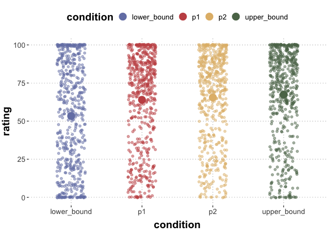

CS3: interpretation proposer evals
================

``` r
library(tidyverse)
library(brms)
library(tidyboot)
library(cspplot)
```

Read data:

``` r
path = "../data/cs3-interpretation-proposer/results_19_SAGE_cs3-interpretation-proposer-evals_full.csv"
d <- read_csv(path)
```

    ## Rows: 864 Columns: 22
    ## ── Column specification ────────────────────────────────────────────────────────
    ## Delimiter: ","
    ## chr (10): assumption, comments, correct_answer, education, gender, inference...
    ## dbl (12): submission_id, age, experiment_duration, experiment_end_time, expe...
    ## 
    ## ℹ Use `spec()` to retrieve the full column specification for this data.
    ## ℹ Specify the column types or set `show_col_types = FALSE` to quiet this message.

``` r
# exclude prolific info
#d %>% select(-prolific_pid, -prolific_study_id, -prolific_session_id) %>% write_csv(path)
```

Check attention check performance:

``` r
d_preprocessed <- d %>%
  mutate(
    correct_answer = as.numeric(correct_answer),
    lower_bound = as.numeric(lower_bound),
    upper_bound = as.numeric(upper_bound),
    p1 = as.numeric(p1),
    p2 = as.numeric(p2)
  )
```

    ## Warning: There was 1 warning in `mutate()`.
    ## ℹ In argument: `correct_answer = as.numeric(correct_answer)`.
    ## Caused by warning:
    ## ! NAs introduced by coercion

``` r
fillers <- d_preprocessed %>% filter(trial_type == "filler") %>%
  rowwise() %>%
  mutate(
    is_correct = as.numeric(abs(correct_answer - lower_bound) < 6 &
                          abs(correct_answer - upper_bound) < 6 &
                          abs(correct_answer - p1) < 6 &
                          abs(correct_answer - p2) < 6
                          )
         )
# attention check passing rate
sum(fillers$is_correct) / nrow(fillers)
```

    ## [1] 0.1666667

Analyse main trials:

``` r
main_trials <- d_preprocessed %>%
  filter(trial_type == "main")

main_trials_summary <- main_trials %>%
  summarize(
    lower_bound = mean(lower_bound),
    upper_bound = mean(upper_bound),
    p1 = mean(p1),
    p2 = mean(p2)
  ) %>%
  pivot_longer(cols = c(lower_bound, upper_bound, p1, p2), names_to = "condition", values_to = "rating")

main_trials_long <- main_trials %>%
  pivot_longer(cols = c(upper_bound, lower_bound, p1, p2), names_to = "condition", values_to = "rating")

main_trials_long %>%
  ggplot(., aes(x = condition, y = rating, color = condition)) +
  geom_point(alpha=0.5, position=position_jitter(0.2)) +
  geom_point(data = main_trials_summary, aes(x = condition, y = rating, color = condition), size=5) +
  theme_csp()
```

    ## Warning: The `scale_name` argument of `discrete_scale()` is deprecated as of ggplot2
    ## 3.5.0.
    ## This warning is displayed once every 8 hours.
    ## Call `lifecycle::last_lifecycle_warnings()` to see where this warning was
    ## generated.

<!-- -->

Now group these by condition (type of trigger):

``` r
main_trials_summary_byCondition <- main_trials %>%
  group_by(inference_type) %>%
  summarize(
    lower_bound = mean(lower_bound),
    upper_bound = mean(upper_bound),
    p1 = mean(p1),
    p2 = mean(p2)
  ) %>%
  pivot_longer(cols = c(lower_bound, upper_bound, p1, p2), names_to = "condition", values_to = "rating")

main_trials_long %>%
  ggplot(., aes(x = condition, y = rating, color = condition)) +
  geom_point(alpha=0.5, position=position_jitter(0.2)) +
  geom_point(data = main_trials_summary_byCondition, aes(x = condition, y = rating, color = condition), size=5) +
  facet_grid(.~inference_type) +
  theme_csp() +
  theme(axis.text.x = element_text(size = 13, angle = 45, hjust=1))
```

<!-- -->

``` r
main_trials_long_rm <- main_trials_long %>%
  mutate(condition = factor(condition),
         inference_type = factor(inference_type))
contrasts(main_trials_long_rm$condition)
```

    ##             p1 p2 upper_bound
    ## lower_bound  0  0           0
    ## p1           1  0           0
    ## p2           0  1           0
    ## upper_bound  0  0           1

``` r
rm_cs3_inter <- brm(
  rating ~ condition + (1 | item_id) + (1 | submission_id),
  data = main_trials_long_rm,
  iter = 4000
)
```

    ## Compiling Stan program...

    ## Trying to compile a simple C file

    ## Running /Library/Frameworks/R.framework/Resources/bin/R CMD SHLIB foo.c
    ## clang -arch arm64 -I"/Library/Frameworks/R.framework/Resources/include" -DNDEBUG   -I"/Library/Frameworks/R.framework/Versions/4.2-arm64/Resources/library/Rcpp/include/"  -I"/Library/Frameworks/R.framework/Versions/4.2-arm64/Resources/library/RcppEigen/include/"  -I"/Library/Frameworks/R.framework/Versions/4.2-arm64/Resources/library/RcppEigen/include/unsupported"  -I"/Library/Frameworks/R.framework/Versions/4.2-arm64/Resources/library/BH/include" -I"/Library/Frameworks/R.framework/Versions/4.2-arm64/Resources/library/StanHeaders/include/src/"  -I"/Library/Frameworks/R.framework/Versions/4.2-arm64/Resources/library/StanHeaders/include/"  -I"/Library/Frameworks/R.framework/Versions/4.2-arm64/Resources/library/RcppParallel/include/"  -I"/Library/Frameworks/R.framework/Versions/4.2-arm64/Resources/library/rstan/include" -DEIGEN_NO_DEBUG  -DBOOST_DISABLE_ASSERTS  -DBOOST_PENDING_INTEGER_LOG2_HPP  -DSTAN_THREADS  -DBOOST_NO_AUTO_PTR  -include '/Library/Frameworks/R.framework/Versions/4.2-arm64/Resources/library/StanHeaders/include/stan/math/prim/mat/fun/Eigen.hpp'  -D_REENTRANT -DRCPP_PARALLEL_USE_TBB=1   -I/opt/R/arm64/include   -fPIC  -falign-functions=64 -Wall -g -O2  -c foo.c -o foo.o
    ## In file included from <built-in>:1:
    ## In file included from /Library/Frameworks/R.framework/Versions/4.2-arm64/Resources/library/StanHeaders/include/stan/math/prim/mat/fun/Eigen.hpp:13:
    ## In file included from /Library/Frameworks/R.framework/Versions/4.2-arm64/Resources/library/RcppEigen/include/Eigen/Dense:1:
    ## In file included from /Library/Frameworks/R.framework/Versions/4.2-arm64/Resources/library/RcppEigen/include/Eigen/Core:88:
    ## /Library/Frameworks/R.framework/Versions/4.2-arm64/Resources/library/RcppEigen/include/Eigen/src/Core/util/Macros.h:628:1: error: unknown type name 'namespace'
    ## namespace Eigen {
    ## ^
    ## /Library/Frameworks/R.framework/Versions/4.2-arm64/Resources/library/RcppEigen/include/Eigen/src/Core/util/Macros.h:628:16: error: expected ';' after top level declarator
    ## namespace Eigen {
    ##                ^
    ##                ;
    ## In file included from <built-in>:1:
    ## In file included from /Library/Frameworks/R.framework/Versions/4.2-arm64/Resources/library/StanHeaders/include/stan/math/prim/mat/fun/Eigen.hpp:13:
    ## In file included from /Library/Frameworks/R.framework/Versions/4.2-arm64/Resources/library/RcppEigen/include/Eigen/Dense:1:
    ## /Library/Frameworks/R.framework/Versions/4.2-arm64/Resources/library/RcppEigen/include/Eigen/Core:96:10: fatal error: 'complex' file not found
    ## #include <complex>
    ##          ^~~~~~~~~
    ## 3 errors generated.
    ## make: *** [foo.o] Error 1

    ## Start sampling

    ## 
    ## SAMPLING FOR MODEL '0be6157812ec6b3d7cff99257349c12e' NOW (CHAIN 1).
    ## Chain 1: 
    ## Chain 1: Gradient evaluation took 0.00019 seconds
    ## Chain 1: 1000 transitions using 10 leapfrog steps per transition would take 1.9 seconds.
    ## Chain 1: Adjust your expectations accordingly!
    ## Chain 1: 
    ## Chain 1: 
    ## Chain 1: Iteration:    1 / 4000 [  0%]  (Warmup)
    ## Chain 1: Iteration:  400 / 4000 [ 10%]  (Warmup)
    ## Chain 1: Iteration:  800 / 4000 [ 20%]  (Warmup)
    ## Chain 1: Iteration: 1200 / 4000 [ 30%]  (Warmup)
    ## Chain 1: Iteration: 1600 / 4000 [ 40%]  (Warmup)
    ## Chain 1: Iteration: 2000 / 4000 [ 50%]  (Warmup)
    ## Chain 1: Iteration: 2001 / 4000 [ 50%]  (Sampling)
    ## Chain 1: Iteration: 2400 / 4000 [ 60%]  (Sampling)
    ## Chain 1: Iteration: 2800 / 4000 [ 70%]  (Sampling)
    ## Chain 1: Iteration: 3200 / 4000 [ 80%]  (Sampling)
    ## Chain 1: Iteration: 3600 / 4000 [ 90%]  (Sampling)
    ## Chain 1: Iteration: 4000 / 4000 [100%]  (Sampling)
    ## Chain 1: 
    ## Chain 1:  Elapsed Time: 5.10148 seconds (Warm-up)
    ## Chain 1:                3.23256 seconds (Sampling)
    ## Chain 1:                8.33404 seconds (Total)
    ## Chain 1: 
    ## 
    ## SAMPLING FOR MODEL '0be6157812ec6b3d7cff99257349c12e' NOW (CHAIN 2).
    ## Chain 2: 
    ## Chain 2: Gradient evaluation took 0.000115 seconds
    ## Chain 2: 1000 transitions using 10 leapfrog steps per transition would take 1.15 seconds.
    ## Chain 2: Adjust your expectations accordingly!
    ## Chain 2: 
    ## Chain 2: 
    ## Chain 2: Iteration:    1 / 4000 [  0%]  (Warmup)
    ## Chain 2: Iteration:  400 / 4000 [ 10%]  (Warmup)
    ## Chain 2: Iteration:  800 / 4000 [ 20%]  (Warmup)
    ## Chain 2: Iteration: 1200 / 4000 [ 30%]  (Warmup)
    ## Chain 2: Iteration: 1600 / 4000 [ 40%]  (Warmup)
    ## Chain 2: Iteration: 2000 / 4000 [ 50%]  (Warmup)
    ## Chain 2: Iteration: 2001 / 4000 [ 50%]  (Sampling)
    ## Chain 2: Iteration: 2400 / 4000 [ 60%]  (Sampling)
    ## Chain 2: Iteration: 2800 / 4000 [ 70%]  (Sampling)
    ## Chain 2: Iteration: 3200 / 4000 [ 80%]  (Sampling)
    ## Chain 2: Iteration: 3600 / 4000 [ 90%]  (Sampling)
    ## Chain 2: Iteration: 4000 / 4000 [100%]  (Sampling)
    ## Chain 2: 
    ## Chain 2:  Elapsed Time: 4.99246 seconds (Warm-up)
    ## Chain 2:                3.22608 seconds (Sampling)
    ## Chain 2:                8.21854 seconds (Total)
    ## Chain 2: 
    ## 
    ## SAMPLING FOR MODEL '0be6157812ec6b3d7cff99257349c12e' NOW (CHAIN 3).
    ## Chain 3: 
    ## Chain 3: Gradient evaluation took 0.000119 seconds
    ## Chain 3: 1000 transitions using 10 leapfrog steps per transition would take 1.19 seconds.
    ## Chain 3: Adjust your expectations accordingly!
    ## Chain 3: 
    ## Chain 3: 
    ## Chain 3: Iteration:    1 / 4000 [  0%]  (Warmup)
    ## Chain 3: Iteration:  400 / 4000 [ 10%]  (Warmup)
    ## Chain 3: Iteration:  800 / 4000 [ 20%]  (Warmup)
    ## Chain 3: Iteration: 1200 / 4000 [ 30%]  (Warmup)
    ## Chain 3: Iteration: 1600 / 4000 [ 40%]  (Warmup)
    ## Chain 3: Iteration: 2000 / 4000 [ 50%]  (Warmup)
    ## Chain 3: Iteration: 2001 / 4000 [ 50%]  (Sampling)
    ## Chain 3: Iteration: 2400 / 4000 [ 60%]  (Sampling)
    ## Chain 3: Iteration: 2800 / 4000 [ 70%]  (Sampling)
    ## Chain 3: Iteration: 3200 / 4000 [ 80%]  (Sampling)
    ## Chain 3: Iteration: 3600 / 4000 [ 90%]  (Sampling)
    ## Chain 3: Iteration: 4000 / 4000 [100%]  (Sampling)
    ## Chain 3: 
    ## Chain 3:  Elapsed Time: 5.19031 seconds (Warm-up)
    ## Chain 3:                3.24037 seconds (Sampling)
    ## Chain 3:                8.43068 seconds (Total)
    ## Chain 3: 
    ## 
    ## SAMPLING FOR MODEL '0be6157812ec6b3d7cff99257349c12e' NOW (CHAIN 4).
    ## Chain 4: 
    ## Chain 4: Gradient evaluation took 0.000113 seconds
    ## Chain 4: 1000 transitions using 10 leapfrog steps per transition would take 1.13 seconds.
    ## Chain 4: Adjust your expectations accordingly!
    ## Chain 4: 
    ## Chain 4: 
    ## Chain 4: Iteration:    1 / 4000 [  0%]  (Warmup)
    ## Chain 4: Iteration:  400 / 4000 [ 10%]  (Warmup)
    ## Chain 4: Iteration:  800 / 4000 [ 20%]  (Warmup)
    ## Chain 4: Iteration: 1200 / 4000 [ 30%]  (Warmup)
    ## Chain 4: Iteration: 1600 / 4000 [ 40%]  (Warmup)
    ## Chain 4: Iteration: 2000 / 4000 [ 50%]  (Warmup)
    ## Chain 4: Iteration: 2001 / 4000 [ 50%]  (Sampling)
    ## Chain 4: Iteration: 2400 / 4000 [ 60%]  (Sampling)
    ## Chain 4: Iteration: 2800 / 4000 [ 70%]  (Sampling)
    ## Chain 4: Iteration: 3200 / 4000 [ 80%]  (Sampling)
    ## Chain 4: Iteration: 3600 / 4000 [ 90%]  (Sampling)
    ## Chain 4: Iteration: 4000 / 4000 [100%]  (Sampling)
    ## Chain 4: 
    ## Chain 4:  Elapsed Time: 4.98808 seconds (Warm-up)
    ## Chain 4:                3.23439 seconds (Sampling)
    ## Chain 4:                8.22247 seconds (Total)
    ## Chain 4:

``` r
summary(rm_cs3_inter)
```

    ##  Family: gaussian 
    ##   Links: mu = identity; sigma = identity 
    ## Formula: rating ~ condition + (1 | item_id) + (1 | submission_id) 
    ##    Data: main_trials_long_rm (Number of observations: 2160) 
    ##   Draws: 4 chains, each with iter = 4000; warmup = 2000; thin = 1;
    ##          total post-warmup draws = 8000
    ## 
    ## Group-Level Effects: 
    ## ~item_id (Number of levels: 21) 
    ##               Estimate Est.Error l-95% CI u-95% CI Rhat Bulk_ESS Tail_ESS
    ## sd(Intercept)     8.07      1.70     5.29    12.02 1.00     2661     4648
    ## 
    ## ~submission_id (Number of levels: 108) 
    ##               Estimate Est.Error l-95% CI u-95% CI Rhat Bulk_ESS Tail_ESS
    ## sd(Intercept)     9.21      1.01     7.35    11.32 1.00     3484     4454
    ## 
    ## Population-Level Effects: 
    ##                      Estimate Est.Error l-95% CI u-95% CI Rhat Bulk_ESS
    ## Intercept               52.44      2.39    47.68    57.15 1.00     2258
    ## conditionp1             10.58      1.77     7.09    13.97 1.00     7832
    ## conditionp2             12.17      1.81     8.59    15.77 1.00     7723
    ## conditionupper_bound    14.00      1.78    10.56    17.48 1.00     7801
    ##                      Tail_ESS
    ## Intercept                3415
    ## conditionp1              6404
    ## conditionp2              6024
    ## conditionupper_bound     6704
    ## 
    ## Family Specific Parameters: 
    ##       Estimate Est.Error l-95% CI u-95% CI Rhat Bulk_ESS Tail_ESS
    ## sigma    29.39      0.46    28.50    30.30 1.00    11760     5930
    ## 
    ## Draws were sampled using sampling(NUTS). For each parameter, Bulk_ESS
    ## and Tail_ESS are effective sample size measures, and Rhat is the potential
    ## scale reduction factor on split chains (at convergence, Rhat = 1).
