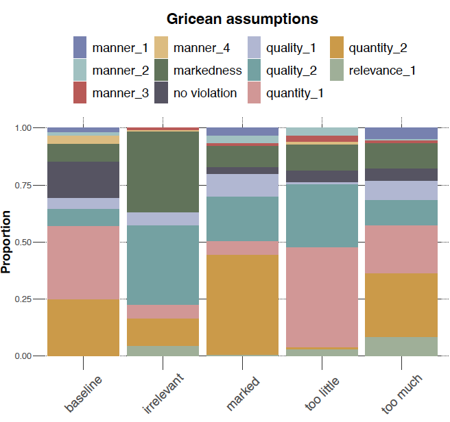

```{r, warning=FALSE, message=FALSE}
library(tidyverse)
library(brms)
library(tidyboot)
library(cspplot)
```

Read data:
```{r}
path = "../data/cs3-maxim-evaluator/results_18_SAGE_cs3-maxim-evaluator-evals_full.csv"
d <- read_csv(path)
# exclude prolific info
#d %>% select(-prolific_pid, -prolific_study_id, -prolific_session_id) %>% write_csv(path)
```

Check attention check performance:
```{r}
fillers <- d %>% filter(trial_type == "filler") %>%
  rowwise() %>%
  mutate(
    is_correct = correct_answer == violation
         )
# attention check passing rate
sum(fillers$is_correct) / nrow(fillers)

d %>% pull(submission_id) %>% unique() %>% length()
```

Analyse main trials. Plot the proportion of times where participants said a particular assumption was violated. The void parts of the bars are the cases where participants indicated that the assumption was not violated. 
```{r}
# TODO add the actual violation texts
#labels <- read_csv()

main_trials <- d %>%
  filter(trial_type == "main") %>%
  mutate(violation = ifelse(violation == 'Yes', 1, 0))

main_trials_summary <- main_trials %>%
  group_by(inference_type) %>%
  mutate(num_conditions = n()) %>%
  group_by(inference_type, assumption) %>%
  summarize(
    violation_prop = sum(violation) / num_conditions
  ) %>%
  unique()

# fill in `no violation` 
main_trials_summary_filled <- main_trials_summary %>%
  ungroup() %>%
  group_by(inference_type) %>%
  mutate(no_violation = 1 - sum(violation_prop)) %>%
  pivot_longer(
    cols = c(violation_prop, no_violation),
    values_to = 'filled_values',
    names_to = 'filled_column'
  ) %>%
  mutate(
    assumption_col = case_when(
      filled_column == 'violation_prop' ~ assumption,
      TRUE ~ filled_column
    ),
    assumption_col = factor(assumption_col, levels = rev(c("manner_1", "manner_2", "manner_3", "manner_4",
                                                       "quality_1", "quality_2", "quantity_1", "quantity_2", "relevance_1", "no_violation")))
  ) %>%
  select(-assumption, -filled_column) %>%
  unique()

main_trials_summary_filled %>%
  rename(assumption = assumption_col, proportion = filled_values, condition = inference_type) %>%
  ggplot(., aes(x = condition, y = proportion, fill = assumption)) +
  geom_col(alpha=0.7) +
  theme_csp()

#ggsave("figs/human_maxim_violation_props.png", width=10, height=6)
```

Check which assumptions are 
```{r}
main_trials_summary_filled %>%
  arrange(inference_type, filled_values)
```

For reference, the LLM evaluator judgements are shown here:



We also aggregate the single assumptions into the basic maxims.
```{r}

```