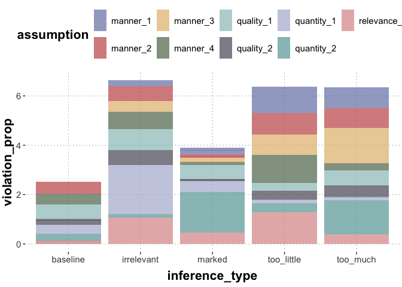

CS3: interpretation proposer evals
================

``` r
library(tidyverse)
library(brms)
library(tidyboot)
library(cspplot)
```

Read data:

``` r
path = "../data/cs3-maxim-evaluator/results_18_SAGE_cs3-maxim-evaluator-evals_pilot-1_10.csv"
d <- read_csv(path)
```

    ## Rows: 60 Columns: 17
    ## ── Column specification ────────────────────────────────────────────────────────
    ## Delimiter: ","
    ## chr (9): assumption, comments, correct_answer, education, gender, inference_...
    ## dbl (8): submission_id, age, experiment_duration, experiment_end_time, exper...
    ## 
    ## ℹ Use `spec()` to retrieve the full column specification for this data.
    ## ℹ Specify the column types or set `show_col_types = FALSE` to quiet this message.

``` r
# exclude prolific info
#d %>% select(-prolific_pid, -prolific_study_id, -prolific_session_id) %>% write_csv(path)
```

Check attention check performance:

``` r
fillers <- d %>% filter(trial_type == "filler") %>%
  rowwise() %>%
  mutate(
    is_correct = correct_answer == violation
         )
# attention check passing rate
sum(fillers$is_correct) / nrow(fillers)
```

    ## [1] 1

Analyse main trials. Plot the proportion of times where participants
said a particular assumption was violated. The void parts of the bars
are the cases where participants indicated that the assumption was not
violated.

``` r
# TODO add the actual violation texts
#labels <- read_csv()

main_trials <- d %>%
  filter(trial_type == "main") %>%
  mutate(violation = ifelse(violation == 'Yes', 1, 0))

main_trials_summary <- main_trials %>%
  group_by(inference_type) %>%
  mutate(num_conditions = n()) %>%
  group_by(inference_type, assumption) %>%
  summarize(
    violation_prop = sum(violation) / num_conditions
  ) 
```

    ## Warning: Returning more (or less) than 1 row per `summarise()` group was deprecated in
    ## dplyr 1.1.0.
    ## ℹ Please use `reframe()` instead.
    ## ℹ When switching from `summarise()` to `reframe()`, remember that `reframe()`
    ##   always returns an ungrouped data frame and adjust accordingly.
    ## Call `lifecycle::last_lifecycle_warnings()` to see where this warning was
    ## generated.

    ## `summarise()` has grouped output by 'inference_type', 'assumption'. You can
    ## override using the `.groups` argument.

``` r
main_trials_summary %>%
  ggplot(., aes(x = inference_type, y = violation_prop, fill = assumption)) +
  geom_col(alpha=0.7) +
  theme_csp()
```

    ## Warning: The `scale_name` argument of `discrete_scale()` is deprecated as of ggplot2
    ## 3.5.0.
    ## This warning is displayed once every 8 hours.
    ## Call `lifecycle::last_lifecycle_warnings()` to see where this warning was
    ## generated.

<!-- -->

For reference, the LLM evaluator judgements are shown here:

<figure>

<figcaption aria-hidden="true">LLM-maxim-evaluator-results</figcaption>
</figure>
